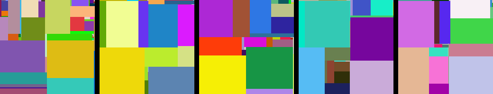

# Max Rects

An implementation of the [maximal rectangles algorithm](http://pds25.egloos.com/pds/201504/21/98/RectangleBinPack.pdf) by Jukka Jylänki for 2d bin packing.
This crate utilizes the MaxRects algorithm to efficiently pack a given number of boxes into a specified number of bins, and generate a visualization of the packing result.

This was created as an effort to learn rust with one of my favorite algorithms.
Included is a png generator to visualize results:



## Features

- Implementation of MaxRects algorithm for efficient packing.
- Generation of visual output to understand the packing result.

### Usage

1. Clone this repository to your local machine.
```bash
git clone https://github.com/jeremycg/max_rects.git
cd max_rects
```
2. Run the program with the desired number of boxes and bins.

```bash
cargo run -- -b 50 -n 10
```

3. You can also import and use this crate in your own code

```rust
use max_rects::{Bucket, MaxRects, PackingBox};

fn main() {
        let boxes = vec![PackingBox::new(5, 6), PackingBox::new(4, 4)];
        let bins = vec![Bucket::new(10, 20, 0, 0, 1)];
        let mut max_rects = MaxRects::new(boxes, bins);
        let (placed, remaining, updated_bins) = max_rects.place();
}
```

## Command-line Arguments
* -b or --boxes: Sets the number of boxes to place (required).
* -n or --bins: Sets the number of bins to pack (required).

## Documentation
You can generate the documentation for this crate by running:

```bash
cargo doc --open
```

## License
This project is licensed under the MIT License - see the LICENSE.md file for details.

## Contributing
Feel free to submit issues and pull requests, we appreciate your help!
